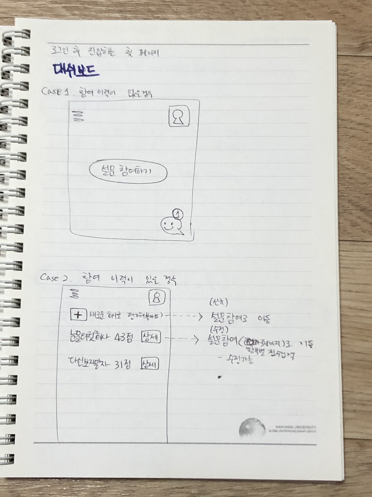
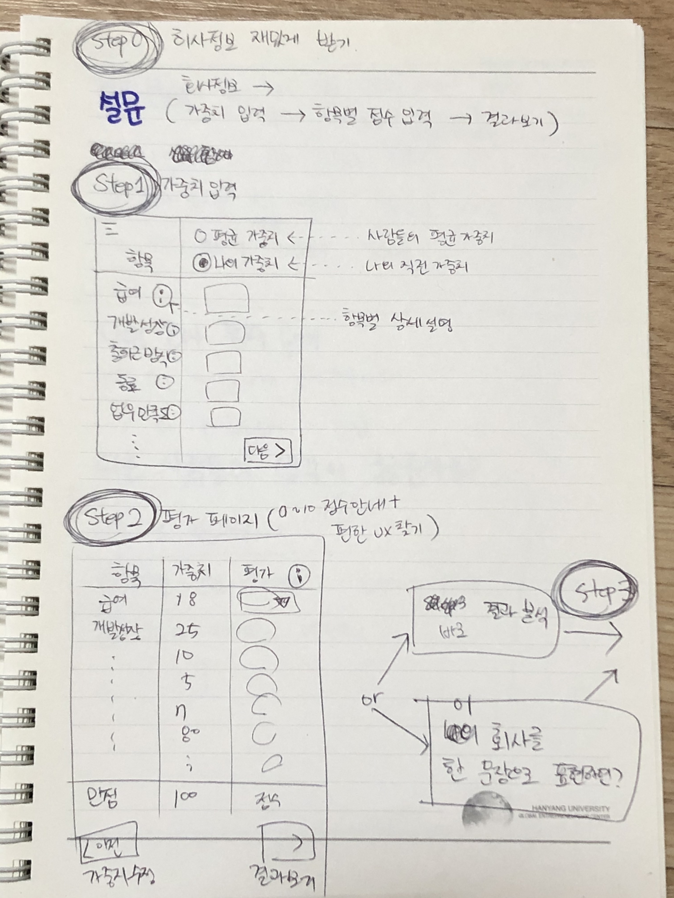
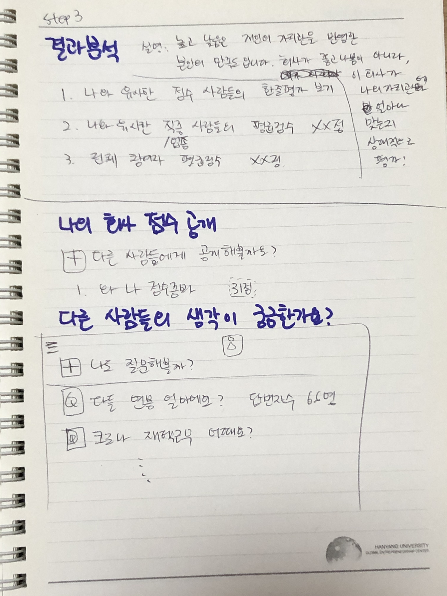

# 최초의 기획서
- 회의 참여자 : 김슬기, 이진섭, 임주현, 오윤주, 김민정, 고경운, 김현아
- [구글 프레젠테이션](https://docs.google.com/presentation/d/1IgZFwpQKgF42094X0IUaZOBz7_1UvPQR4weeYwxw2O8/edit?usp=sharing)
- 이정도면 아주 훌륭한 퀄리티의 기획서구만 :)

### 1. 설문조사 참여 조건과 회원가입
- 서비스 확장을 위해 무조건 회원가입 유도?
- 서비스 확산을 위해 일반 설문처럼 가볍게 카톡방에 공유해서 사용할 수 있도록 익명 회원 처리?

### 2. 대시보드 (홈화면)
- 메신저 기능 : 우측 하단, 메신저처럼 보이지만 사실 공지사항을 메시지 형식으로 표시함
- 메뉴 기능 : 좌측 상단, 설문조사 참여 및 이력 확인 외에 기능들을 메뉴로 묶을 예정
- case1. 설문조사 참여 이력이 없는 경우(혹은 익명회원)
    - 설문조사 참여를 바로 할 수 있도록 크게 안내
- case2. 설문조사 참여 이력이 있는 회원의 경우
    - 과거에 참여했던 설문 이력과 점수, 상세보기/수정이 가능한 화면으로 이동 가능
    - 추가 설문 참여가 가능하도록 같은 레벨 최상단에 버튼 추가
- 

### 3. 설문조사 진행
- Step 1 : 회사 및 기본정보 재미있게 받기 (회원의 경우 회원가입 시 받은 정보를 자동 세팅)
    - 나의 성별과 현재 나이는 [...]야...
    - 내가 다니는(다녔던) 회사 이름은 [...]이었지, 후후...
    - 나의 직종(?)/업종(?)은 [...]에서 일하며...
    - [...]라는 직업을 갖고 있었지...(아련)
    - 고민1 : 직종 혹은 업종은 어디서 정보를 가져올까?
    - 고민2 : 직업 정보는?
- Step 2 : 가중치 입력
    - 항목별로 가중치 입력
    - 고민1 : 어떻게 1점(말할가치없음)~10점(뭐엿는지까머금)을 쉽게 표현할 수 있을까? 숫자로 하면 다들 감이 달라서 한글이여야할 것 같아.
    - 고민2 : 회원은 과거에 입력한 가중치를 불러오면 되는데, 최초 입력 고객들에게 가중치를 쉽게 적을 수 있게 도와주려면 어떻게 해야할까?
- Step 3 : 나의 회사를 한 문장으로 표현하기 (점수보기 전)
    - ex) 음... 만족도 7에 불만족 3인데, 불만족 3이 커서 이직을 할까 고민중임
    - ex) ㅋㅋㅋ 첫 직장인데 회사분들도 다들 친절해서 생각보다 만족스러움!
- 

### 4. 설문조사 결과 (+그 외 고객 이탈 방지를 위한 재미있는 기능)
- Step 4 (결과 해석)
    - 점수 공개
    - 생각보다 낮은 점수에 이용자들이 놀라지 않도록 점수에 대해 해석을 잘 해주기 :)
    - **@@아래부분은 로그인해야 볼 수 있음, 제목만 보여줌@@**
    - 본인과 가치관이 유사한 사람들의 평균 점수는 어떨까요?
    - 나와 비슷한 점수의 사람들은 회사를 어떻게 표현했을까요? (본인 점수의 +-5점의 사람들의 한줄 문장 보여주기)
    - 전체 참가자들의 평균 만족도 점수는 어느 정도일까요?

- 부가기능1 : 다른 사람들의 생각이 궁금한가요?
    - 사용자가 직접 질문을 올리면 사용자들이 답변하는 형태 (혹은 관리자가 질문 올림)
    - 답변을 해야 다른사람들의 답변을 볼 수 있음
- 부가기능2 : 나의 회사 점수 공개
    - 본인이 설문한 회사들을 그래프로 표현하여 사람들에게 공개할 수 있음
    - ex) 와, 나 이직하고 만족도 엄청 오름ㅎㅎ
    - ex) ㅠㅠ내 가치관은 이러이러한데 현재 회사 생활이 만족스럽지가 않다   
- 

### 5. 카카오톡 공유를 위한 설문참여 Dynamic link 생성
- 썸네일 미정
- 썸네일 제목과 문구 미정