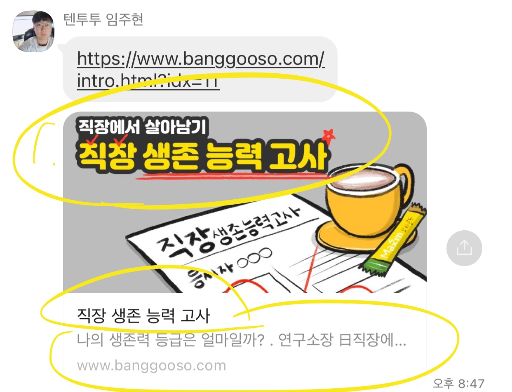

# 우리의 첫 만남, 첫 회의
- 회의 참여자 : 김슬기, 이진섭, 임주현, 오윤주, 김민정, 고경운, 김현아
- [구글 프레젠테이션](https://docs.google.com/presentation/d/1IgZFwpQKgF42094X0IUaZOBz7_1UvPQR4weeYwxw2O8/edit?usp=sharing)

### 기획 공유 후 피드백
- 카카오톡을 통한 설문조사 전파
   - 제목
        - 내 직장 이대로 괜찮은가?
        - 나와 직장의 궁합은?
        - 나는 회사에서 행복한가?
        - 이직 할까?말까? (X)
        - 딜러구트 꿈백화점 (?)
   - 내용 : 나의 가치관에 맞는 회사 만족도는 어느 정도일까? 
   - 썸네일
        - 썸네일 제목 : 제목과 동일
        - 썸네일 부제목 : ??
        - 썸네일 이미지 : ??
   - 
- 설문과 회원가입 유도 프로세스
   - 비회원 설문 시 자동 익명 회원 처리
   - 회원으로 전환할 수 있도록 흥미로운 컨텐츠 공유(개다른 회원의 가중치, 결과, 한줄문장 등 공개 등)
- 가중치 설정의 어려움
   - 모든 항목 default 10으로 설정
   - 과거에 입력했던 가중치 자동으로 불러오기
   - 평균적인 가중치 불러오기 => 오해의 여지?
- 가중치 답변의 스케일
    - 10개의 옵션을 주는 것은 피로도가 있을 수 있음, 하지만 좀 더 세밀한 표현 가능
    - 단순 숫자로 1~10 주는 것 보다는 확실한 텍스트가 오해의 여지가 줄어들 수도 => 하지만 한 눈에 들어오지 않음

### 서비스명 정하기
- 채택 : Company Interview
   - 의미1 : 나도 면접관으로서 회사를 평가하겠다!
   - 의미2 : 사람들에게 이직이나 퇴사를 권장하는 게 아니라 본인의 가치관에 맞게 회사를 평가해서, 스스로 행복해질 수 있는 방법을 찾길 바란다!
- 그 외 좋았던 의견
   - 직장만족도
   - 이직할까말까
   - 이직학교
   - 바람직하게 일하기
   - 이직의 정석
   - 두번째 망함
 
### 기술 스텍 (추가논의 필요)
제안 : 백엔드 최소화하여 가볍고 빠른 런칭
1. 목적에 충실하고 러닝커브가 적은 옵션?
   - 단순 데이터 수집이 목표라면 구글 설문폼도 괜찮은 옵션
   - Excel API
   - Firestore API
2. 그래도 스케일아웃을 고려한다면?
   - GraphQL
   - RDS